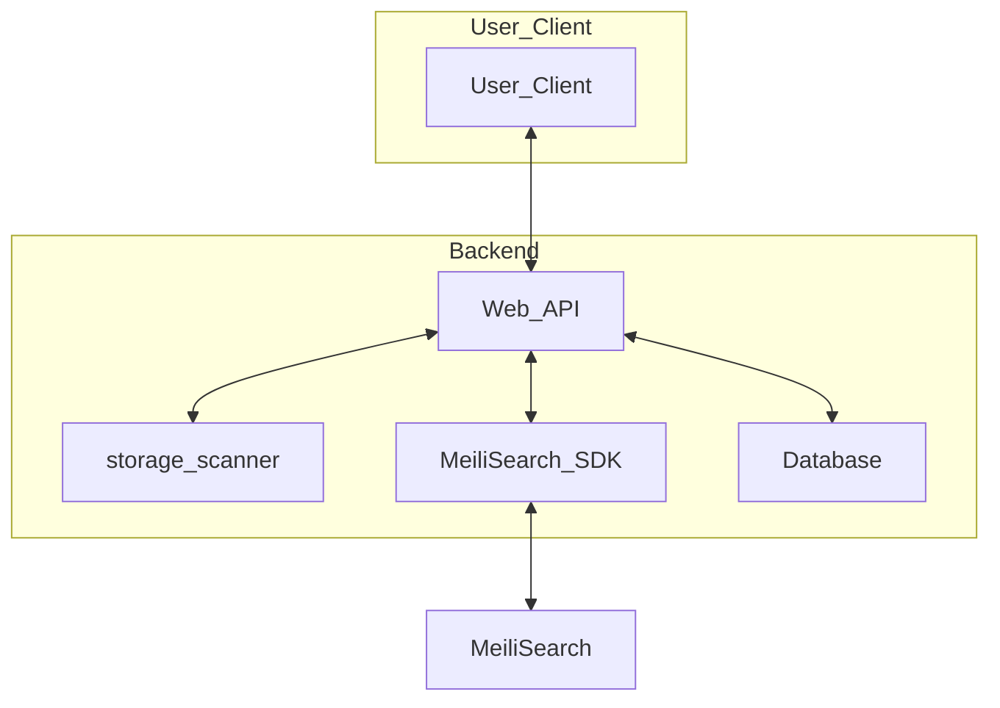

# 项目架构图

```mermaid
flowchart TD
    subgraph User_Client
    U["User_Client"]
    end
    subgraph Backend
    Web_API <--> storage_scanner
    Web_API <--> MeiliSearch_SDK
    Web_API <--> Database
    end
    S["MeiliSearch"]
    U <--> Web_API
    MeiliSearch_SDK <--> S
```

MeiliSearch 负责索引歌曲信息、专辑信息、艺术家信息。