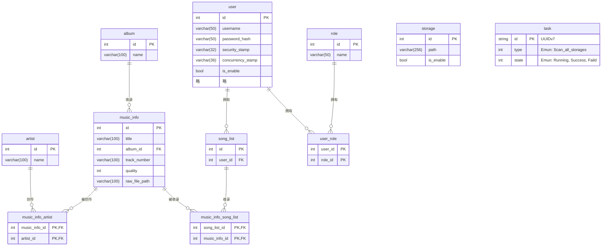

# 音乐管理系统后端 ER 图

```mermaid
erDiagram
    music_info {
        int id PK
        varchar(100) title
        int album_id FK
        varchar(100) ​​track_number​​
        int quality
        varchar(100) raw_file_path
    }
    artist {
        int id PK
        varchar(100) name
    }
    music_info_artist {
        int music_info_id PK, FK
        int artist_id PK, FK
    }
    album {
        int id PK
        varchar(100) name
    }
    song_list {
        int id PK
        int user_id FK
    }
    music_info_song_list {
        int song_list_id PK, FK
        int music_info_id PK, FK
    }
    user {
        int id PK
        varchar(50) username
        varchar(50) password_hash
        varchar(32) security_stamp
        varchar(36) concurrency_stamp
        bool is_enable
        略 略
    }
    role {
        int id PK
        varchar(50) name
    }
    user_role {
        int user_id PK
        int role_id PK
    }

    artist ||--o{ music_info_artist : 创作
    music_info ||--o{ music_info_artist : 被创作
    album ||--o{ music_info : 收录
    music_info ||--o{ music_info_song_list : 被收录
    song_list ||--o{ music_info_song_list : 收录
    user ||--o{ song_list : 拥有
    user ||--o{ user_role : 拥有
    role ||--o{ user_role : 拥有

    storage {
        int id PK
        varchar(256) path
        bool is_enable
    }

    task {
        string id PK "UUIDv7"
        int type "Emun: Scan_all_storages"
        int state "Emun: Running, Success, Faild"
    }
```
